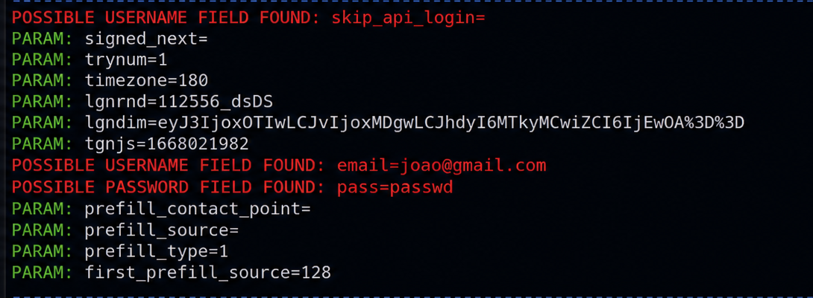

# 🔐 Phishing e Engenharia Social: Análise Técnica e Estratégias de Defesa

## 📌 Objetivo

Este projeto tem como objetivo demonstrar, em ambiente controlado, como ataques de phishing podem ser estruturados, analisados e mitigados, com foco em segurança da informação e comportamento humano.

---

## 🧠 Contexto

O phishing é uma das principais ameaças cibernéticas atuais, explorando vulnerabilidades humanas para obtenção de credenciais e acesso indevido a sistemas.

### 🚨 Impactos potenciais:
- Vazamento de dados sensíveis  
- Acesso não autorizado  
- Perdas financeiras  
- Danos à reputação  

---

## ⚙️ Visão Técnica do Ataque

O processo de phishing pode ser descrito em etapas:

1. **Reconhecimento**
2. **Engenharia social**
3. **Entrega (link/página falsa)**
4. **Captura de dados**
5. **Exfiltração**

---

## 🧪 Simulação Controlada

Esta simulação foi realizada com:

- Ambiente local isolado  
- Dados fictícios  
- Página simulada (sem uso de serviços reais)  

📌 Objetivo: compreender o funcionamento técnico sem realizar ataques reais.

---

## 🛠️ Ferramentas

- Kali Linux
- setoolkit

 ## 🔎 Configurando o Phishing no Kali Linux

- Acesso root: ``` sudo su ```
- Iniciando o setoolkit: ``` setoolkit ```
- Tipo de ataque: ``` Social-Engineering Attacks ```
- Vetor de ataque: ``` Web Site Attack Vectors ```
- Método de ataque: ```Credential Harvester Attack Method ```
- Método de ataque: ``` Site Cloner ```
- Obtendo o endereço da máquina: ``` ifconfig ```
- URL para clone: http://www.facebook.com 

## 📸 Evidência visual

### 📸 Captura da simulação



### 🔍 Análise técnica

A saída demonstra a identificação de:

- Campos de usuário  
- Campos de e-mail  
- Campos de senha  

Isso evidencia como aplicações web podem ser analisadas para identificar pontos sensíveis de entrada de dados.

---

## 📊 Análise de Risco

| Risco                 | Probabilidade | Impacto | Nível |
|----------------------|--------------|--------|------|
| Roubo de credenciais | Alta         | Alto   | Crítico |
| Vazamento de dados   | Média        | Alto   | Alto |
| Acesso indevido      | Alta         | Alto   | Crítico |

---

## 🛡️ Estratégias de Defesa

### 🔹 Camada Humana
- Treinamento de conscientização  
- Simulações autorizadas  

### 🔹 Camada Técnica
- Filtros anti-phishing  
- Monitoramento de rede  
- Proteção de e-mail  

### 🔹 Camada de Identidade
- Autenticação multifator (MFA)  
- Políticas de senha forte  

---

## 📈 Métricas de Segurança

- Taxa de cliques em phishing  
- Taxa de reporte de incidentes  
- Tempo de resposta  
- Credenciais comprometidas  

---

## 🔍 Insights Analíticos

A detecção de phishing pode ser tratada como um problema de dados:

- Classificação de e-mails  
- Detecção de anomalias  
- Análise comportamental  

---

## ⚖️ Considerações Éticas

Este projeto possui finalidade exclusivamente educacional.

Não foram utilizadas credenciais reais nem realizados ataques fora de ambiente controlado.

---

## 🚀 Aprendizados

- Compreensão de ataques de engenharia social  
- Visão crítica sobre vulnerabilidades humanas  
- Importância da segurança e ética  
- Aplicação de conceitos de análise de dados em segurança  

---

## 📌 Autor

Projeto desenvolvido para fins educacionais e de portfólio profissional.
